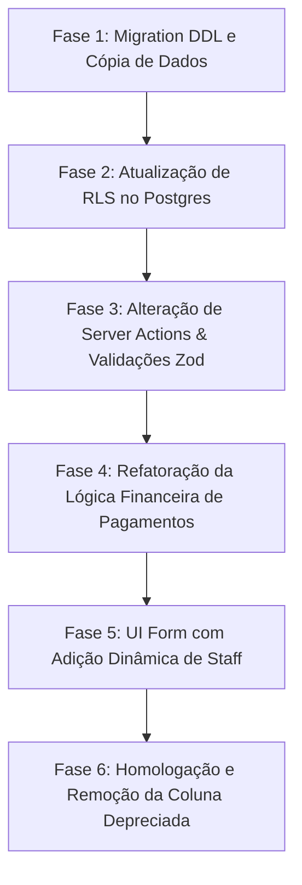

# Estudo de Viabilidade — Múltiplos Funcionários na Ordem de Serviço

Este documento apresenta a análise de viabilidade técnica, os impactos arquiteturais e de negócio, os riscos envolvidos e a solução recomendada para permitir a associação de múltiplos funcionários de limpeza a uma única Ordem de Serviço (OS / Ordine di Lavoro), com divisão proporcional de horas trabalhadas para fins de pagamento.

---

## 1. Viabilidade Técnica Geral

A implementação é **altamente viável**. A arquitetura atual baseada em Next.js 16, Supabase (Postgres) e Server Actions com RLS (Row Level Security) é flexível o suficiente para suportar essa evolução sem a necessidade de reestruturação do núcleo do sistema. 

* **Esforço estimado**: Médio (cerca de 3 a 5 dias de desenvolvimento e testes).
* **Nível de risco**: Baixo a Médio, concentrado principalmente na transição de dados históricos de limpeza e na performance de consultas RLS.

---

## 2. Impactos Técnicos Detalhados

### 2.1. Banco de Dados e Relacionamento

Atualmente, o banco de dados armazena o responsável pela limpeza em uma coluna direta na tabela `service_orders` (`cleaning_staff_id`). Para suportar múltiplos funcionários de limpeza (2, 3 ou mais), a solução exige a transição para um relacionamento **Muitos-para-Muitos (N-N)**.

#### Solução Recomendada: Tabela Associativa Intermediária
Recomenda-se a criação da tabela `service_order_cleaning_staff` para gerenciar a associação.

```sql
-- 1. Criação da tabela associativa
CREATE TABLE public.service_order_cleaning_staff (
  service_order_id  UUID NOT NULL REFERENCES public.service_orders(id) ON DELETE CASCADE,
  profile_id        UUID NOT NULL REFERENCES public.profiles(id) ON DELETE CASCADE,
  created_at        TIMESTAMPTZ NOT NULL DEFAULT NOW(),
  PRIMARY KEY (service_order_id, profile_id)
);

-- 2. Criação de índices para otimização de performance
-- O índice primário já cobre buscas por service_order_id.
-- Criamos um índice composto invertido para otimizar buscas por funcionário (essencial para RLS).
CREATE INDEX IF NOT EXISTS service_order_cleaning_staff_profile_idx 
  ON public.service_order_cleaning_staff (profile_id, service_order_id);
```

#### Estratégia de Migração e Depreciação
Para mitigar riscos em produção, a migração será dividida em etapas:
1. **Migração de Dados Legados**: Rodar um script que insira na tabela associativa as relações existentes na coluna `cleaning_staff_id`.
   ```sql
   INSERT INTO public.service_order_cleaning_staff (service_order_id, profile_id)
   SELECT id, cleaning_staff_id 
   FROM public.service_orders 
   WHERE cleaning_staff_id IS NOT NULL;
   ```
2. **Depreciação Temporária**: Manter a coluna `cleaning_staff_id` como `NULLABLE` no banco (marcada como depreciada em comentários). Após a homologação em produção e atualização de todas as consultas, ela será excluída permanentemente para evitar inconsistências (dupla fonte de verdade).

---

### 2.2. Row Level Security (RLS)

O perfil de acesso `limpeza` só tem permissão para visualizar e atualizar suas próprias Ordens de Serviço. Atualmente, isso é feito checando `cleaning_staff_id = auth.uid()`. Com a tabela associativa, as policies precisam ser reescritas para realizar uma busca de existência (`EXISTS`).

#### Atualizações de Security necessárias:

1. **Policies na Tabela `service_orders` (Select e Update)**:
   ```sql
   -- SELECT para role limpeza
   CREATE POLICY "service_orders_limpeza_select"
     ON public.service_orders FOR SELECT
     USING (
       (SELECT public.get_my_role()) = '"limpeza"'
       AND EXISTS (
         SELECT 1 FROM public.service_order_cleaning_staff socs
         WHERE socs.service_order_id = id
           AND socs.profile_id = (SELECT auth.uid())
       )
     );

   -- UPDATE para role limpeza
   CREATE POLICY "service_orders_limpeza_update"
     ON public.service_orders FOR UPDATE
     USING (
       (SELECT public.get_my_role()) = '"limpeza"'
       AND EXISTS (
         SELECT 1 FROM public.service_order_cleaning_staff socs
         WHERE socs.service_order_id = id
           AND socs.profile_id = (SELECT auth.uid())
       )
     )
     WITH CHECK (
       (SELECT public.get_my_role()) = '"limpeza"'
       AND EXISTS (
         SELECT 1 FROM public.service_order_cleaning_staff socs
         WHERE socs.service_order_id = id
           AND socs.profile_id = (SELECT auth.uid())
       )
     );
   ```

2. **Helper de Segurança Privado `private.staff_property_ids(uid)`**:
   Esta função (definida na [ADR 005](file:///c:/ANTIGRAVITY/Veda%20Bene%20definitivo/docs/decisions/005-rls-helpers-em-schema-privado.md)) deve ser adaptada para incluir os imóveis vinculados a todas as OSs em que o prestador atuou:
   ```sql
   CREATE OR REPLACE FUNCTION private.staff_property_ids(uid UUID)
   RETURNS SETOF UUID
   LANGUAGE sql
   STABLE
   SECURITY DEFINER
   SET search_path = ''
   AS $function$
     SELECT DISTINCT so.property_id
     FROM public.service_orders so
     WHERE so.consegna_staff_id = uid 
        OR EXISTS (
          SELECT 1 FROM public.service_order_cleaning_staff socs
          WHERE socs.service_order_id = so.id
            AND socs.profile_id = uid
        );
   $function$;
   ```

3. **Policy de Visibilidade de Colegas (`profiles_staff_peer_select`)**:
   Deve permitir que funcionários que trabalham na mesma OS visualizem o perfil uns dos outros.

---

### 2.3. Camada de Aplicação (API & Server Actions)

As Server Actions e os validadores Zod precisam se ajustar à nova coleção de IDs.

* **Schema Zod (`app/(app)/service-orders/actions.ts`)**:
  ```diff
  const serviceOrderSchema = z.object({
    property_id: z.string().min(1, 'Immobile obbligatorio').pipe(uuidSchema),
-   cleaning_staff_id: optionalUuidSchema,
+   cleaning_staff_ids: z.array(uuidSchema).max(3, 'Massimo 3 responsabili').default([]),
    consegna_staff_id: optionalUuidSchema,
    ...
  })
  ```
* **Lógica de Persistência em `createServiceOrderImpl` e `updateServiceOrderImpl`**:
  No cadastro e na edição, a gravação de funcionários de limpeza precisará ser feita em formato de transação batch (inserindo e excluindo registros na tabela `service_order_cleaning_staff` de forma segura).

---

### 2.4. Sistema Web e Interface (UI)

O ERP web, usado pela secretaria e admin para criar/editar OSs, deve ser adaptado para suportar a adição intuitiva de múltiplos funcionários.

* **Modificação no Componente `ServiceOrderForm`**:
  Em vez de um select comum para "Responsabile Pulizia", podemos implementar um controle de lista dinâmica:
  - Inicialmente renderiza um select de prestador de limpeza.
  - Exibe um botão **"+ Adicionar Responsável"** (se o limite de 3 não tiver sido atingido).
  - Cada prestador selecionado exibe um botão de exclusão (lixeira) ao lado para fácil manipulação.
* **Componente de Visualização (Listagem e Detalhes)**:
  Exibição dos prestadores em formato de texto separado por vírgula (ex: *"Andy, Bruno"*).

---

### 2.5. Consultas, Relatórios e Cálculo de Pagamento

Este é o ponto de maior impacto operacional e de negócio. A lógica de rateio deve ser matematicamente precisa.

#### A Regra de Divisão Proporcional de Horas
A remuneração mensal do funcionário baseia-se na soma das horas médias das OSs concluídas por ele.
Se a OS for concluída por $N$ prestadores de limpeza, as horas imputadas a cada prestador serão divididas igualmente.

$$\text{Horas Calculadas} = \frac{\text{Tempo Médio do Imóvel}}{\text{Quantidade de Prestadores na OS}}$$

#### Adaptação do Código Financeiro (`lib/server/reporting/financial.ts`)

No método `getPayableDetailRows`:
1. Carregar para cada OS os funcionários de limpeza vinculados através de uma relação join.
2. Contar a quantidade total de funcionários vinculados àquela limpeza ($N$).
3. Dividir as horas brutas: `const assignedHours = avg_cleaning_hours / cleaningStaffCount`.
4. Gerar as linhas de remuneração proporcionalmente para cada um dos prestadores de limpeza vinculados (e integrar com o cálculo normal para o entregador - `consegna_staff_id`, cujas horas permanecem integrais ou não divididas, a depender da regra comercial existente).

#### Exemplo de Fluxo:
* Imóvel X tem tempo médio de **3 horas**.
* A OS #1234 tem **2 funcionários** na limpeza (Ana e Bruno).
* O loop financeiro calculará:
  - Ana: **1.5 horas** no seu relatório individual.
  - Bruno: **1.5 horas** no seu relatório individual.

#### Dashboard e Estimativas de Custo (`getDashboardReportingData`)
A estimativa do custo operacional mensal de pessoal no dashboard (`staffCostByMonth`) precisará considerar a proporcionalidade do tempo de limpeza.

---

### 2.6. Impactos em Performance

* **Carga de queries**: Consultar a lista de ordens de serviço exigirirá junções com a tabela associativa. Em listagens massivas, isso pode aumentar a latência.
* **Mitigação**: 
  - O sistema já utiliza paginação física nas ordens de serviço concluídas (`doneQuery.range()`).
  - Criação de chaves primárias e índices compostos apropriados (conforme seção 2.1).

---

## 3. Riscos e Mitigações

| Risco | Impacto | Mitigação |
|:---|:---|:---|
| **Quebra de consultas legadas** de relatórios ou exportações que ainda referenciam a coluna `cleaning_staff_id`. | Alto | Adotar uma estratégia faseada. Manter a coluna antiga sincronizada (via trigger temporário no banco de dados ou escrita dupla na Server Action) até que todos os componentes estejam testados. |
| **Degradação de performance na RLS** devido a queries aninhadas com `EXISTS` em bancos volumosos. | Médio | Criação de índice composto específico `(profile_id, service_order_id)` para acelerar a checagem RLS. |
| **Inconsistências no cálculo de rateio** (ex: divisão por zero ou arredondamentos incorretos). | Alto | Implementar testes unitários exaustivos na função `getPayableDetailRows` cobrindo cenários com 1, 2, 3 e 0 prestadores de serviço de limpeza. |

---

## 4. Recomendações de Documentação

Recomendamos fortemente documentar este desenvolvimento para garantir que a equipe mantenha o alinhamento arquitetural do ERP.

1. **Architecture Decision Record (ADR)**:
   - A decisão de design arquitetural do banco de dados (tabela intermediária N-N) e o impacto nas políticas de RLS e cálculos financeiros foram formalizados na [ADR 009](file:///c:/ANTIGRAVITY/Veda%20Bene%20definitivo/docs/decisions/009-multiplos-funcionarios-limpeza-na-os.md).
   - O índice de ADRs foi atualizado em [decisions/README.md](file:///c:/ANTIGRAVITY/Veda%20Bene%20definitivo/docs/decisions/README.md).

2. **Wiki Funcional / Especificação de Regras de Negócio**:
   - É recomendável detalhar a regra de divisão de pagamento na documentação de operações financeiras da empresa, exemplificando a proporção de rateio de tempo versus o valor da hora de cada colaborador (`hourly_rate`).

---

## 5. Estratégia de Implementação (Faseada)

Para garantir que a alteração ocorra de forma segura e sem downtime, sugerimos as seguintes etapas:



Esta abordagem garante que o sistema permaneça funcional e seguro durante cada etapa da evolução arquitetural.
